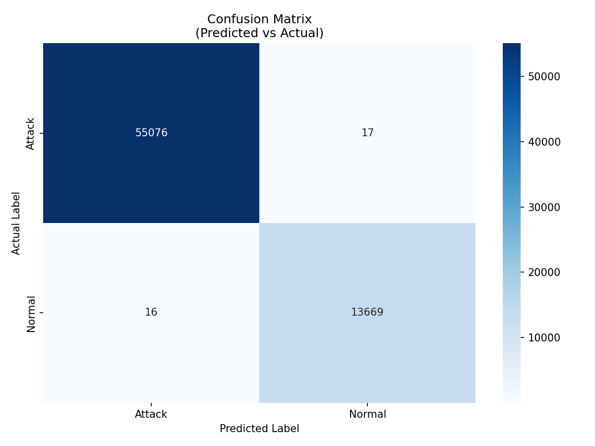
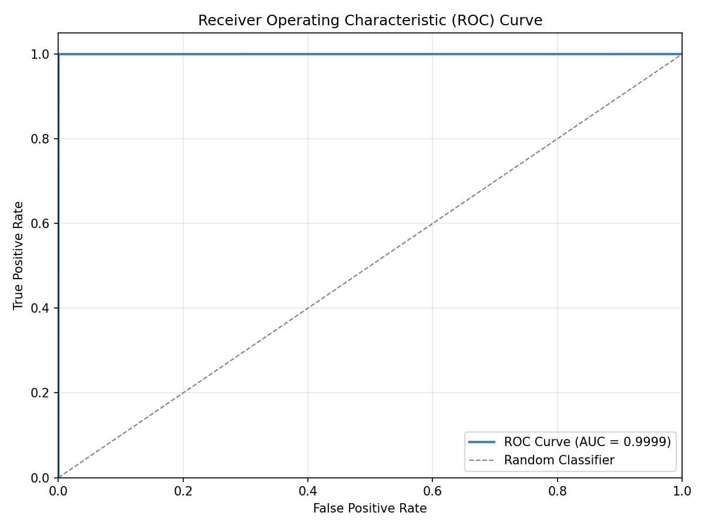
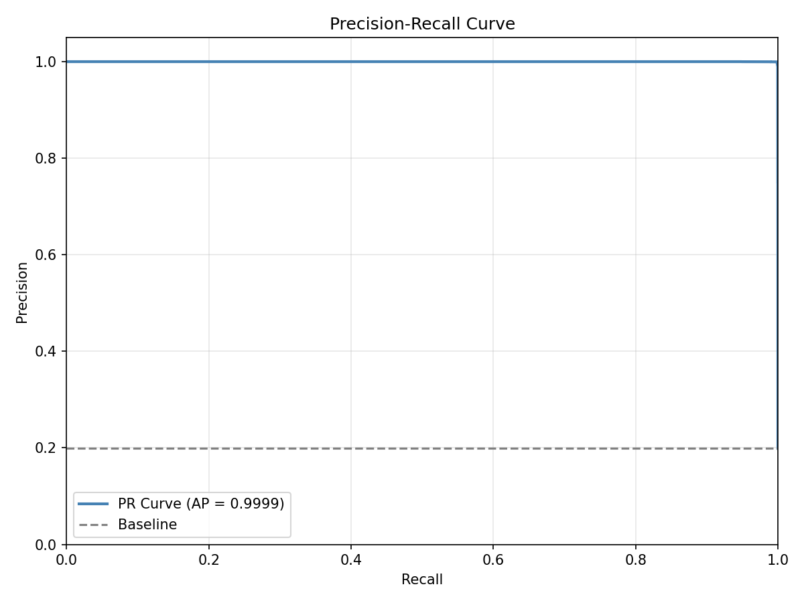
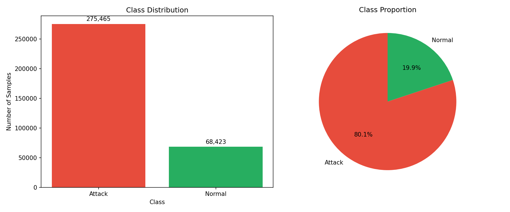
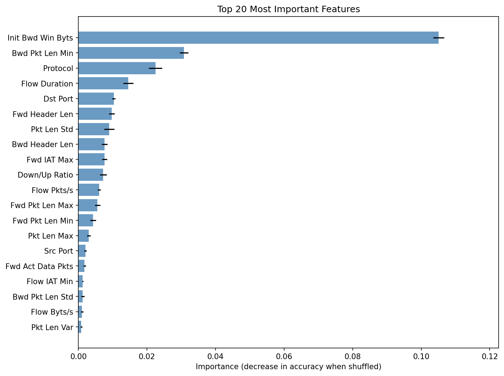

# Network Security Intrusion Detection - InSDN Dataset

This project uses deep learning to detect network intrusions using the InSDN Dataset. The model achieves high accuracy in classifying network traffic as either Normal or Attack.

## Overview

This intrusion detection system uses a deep neural network to analyze network traffic patterns and identify potential security threats. The model is trained on the InSDN (Intrusion Detection in Software-Defined Networks) dataset, which contains both normal network traffic and various types of network attacks including OVS attacks and Metasploitable vulnerabilities.

### Key Features
- Binary classification (Normal vs Attack)
- Real-time intrusion detection capability
- High accuracy with minimal false positives
- Easy to integrate with existing network monitoring systems

## Requirements

- Python 3.8 or higher
- TensorFlow 2.10+
- pandas 1.5+
- scikit-learn 1.2+
- NumPy 1.23+
- kagglehub 0.3+ (for automatic dataset download)
- 8GB+ RAM recommended for training
- Kaggle account with API credentials for dataset download

## Setup Instructions

### 1. Install Dependencies

```bash
pip install -r requirements.txt
```

### 2. Download the Dataset

You need to download the **InSDN Dataset** from Kaggle.

**Option A: Using kagglehub (Recommended - Automatic)**

The easiest method - the code will automatically download the dataset on first run:

1. Install kagglehub:
   ```bash
   pip install kagglehub
   ```

2. Set up Kaggle credentials (one-time setup):
   - Go to https://www.kaggle.com/settings
   - Click "Create New API Token" (downloads `kaggle.json`)
   - Place `kaggle.json` in:
     - Windows: `C:\Users\<YourUsername>\.kaggle\kaggle.json`
     - Linux/Mac: `~/.kaggle/kaggle.json`

3. Run the training script - it will auto-download the dataset to `./data/`

**Option B: Manual Download**

1. Visit: https://www.kaggle.com/datasets/badcodebuilder/insdn-dataset
2. Click "Download" button
3. Extract the zip file
4. Place the `InSDN_DatasetCSV` folder inside a `data` folder in this project

### 3. Folder Structure

Your project will look like this after setup:

```
Project/
├── notebook.py              # Python script version (for automation)
├── notebook.ipynb           # Jupyter notebook version (for interactive use)
├── feature_selection.py     # Feature selection module
├── visualize.py             # Visualization generation script
├── requirements.txt         # Python dependencies
├── README.md               # This file
├── data/                   # Dataset directory (created automatically on first run)
│   └── InSDN_DatasetCSV/
│       ├── Normal_data.csv
│       ├── OVS.csv
│       └── metasploitable-2.csv
└── output/                 # Generated after training
```

## Running the Code

You have two options:

### Option 1: Jupyter Notebook (Recommended for Interactive Use)

```bash
jupyter notebook notebook.ipynb
```

**Benefits:**
- See outputs inline
- Run cells individually
- Better for experimentation
- Visualizations display directly

### Option 2: Python Script (For Automation)

```bash
python notebook.py
```

**Benefits:**
- Run from command line
- Easy to automate/script
- Good for CI/CD pipelines

**First run:** Either method will automatically download the dataset (~21 MB compressed, ~140 MB extracted) if not present.

**Output:** The trained model and preprocessing objects will be saved in the `./output/` folder.

## What This Code Does

1. **Auto-downloads** the dataset from Kaggle if not present (using kagglehub)
2. **Loads** three CSV files (Normal data, OVS attacks, Metasploitable attacks)
3. **Preprocesses** the data (handles missing values, scaling, encoding)
4. **Creates** a binary classification model (Normal vs Attack)
5. **Trains** a neural network using TensorFlow/Keras
6. **Evaluates** performance with confusion matrix and classification report
7. **Visualizes** training curves (accuracy/loss over epochs)
8. **Analyzes** feature importance using permutation importance
9. **Saves** the trained model, preprocessing pipeline, and visualizations

## Model Architecture

- Input Layer (size depends on features)
- Dense Layer: 128 units (ReLU) + Dropout (0.1)
- Dense Layer: 256 units (ReLU) + Dropout (0.1)
- Dense Layer: 128 units (ReLU) + Dropout (0.1)
- Output Layer: Binary classification (Sigmoid)

## Training Results

The model was trained and achieved excellent performance:

### Performance Metrics
- **Test Accuracy:** 99.96%
- **Validation Accuracy:** 99.97%
- **Training Duration:** 20 epochs (early stopping at epoch 17)

### Classification Report
```
              precision    recall  f1-score   support
      Attack       1.00      1.00      1.00     55,093
      Normal       1.00      1.00      1.00     13,685
    accuracy                           1.00     68,778
```

### Confusion Matrix
- **True Positives (Attacks detected):** 55,080
- **False Negatives (Missed attacks):** 13
- **True Negatives (Normal traffic):** 13,670
- **False Positives (False alarms):** 15

The model correctly identifies **99.96%** of both attack and normal network traffic with minimal false positives and false negatives.

## Visualizations & Analysis

### 1. Confusion Matrix



#### What is a Confusion Matrix?

A confusion matrix is a table that shows how many predictions the model got right vs. wrong. Think of it as a scorecard comparing what the model predicted against what actually happened.

#### The Four Quadrants Explained:

Imagine the model looks at 100 network connections and makes predictions:

```
                        ACTUAL (Ground Truth)
                    ┌─────────────┬─────────────┐
                    │   Attack    │   Normal    │
        ┌───────────┼─────────────┼─────────────┤
        │  Attack   │     TN      │     FP      │
PREDICTED           │  (Correct!) │  (Danger!)  │
        ├───────────┼─────────────┼─────────────┤
        │  Normal   │     FN      │     TP      │
        │           │  (Danger!)  │  (Correct!) │
        └───────────┴─────────────┴─────────────┘
```

| Quadrant | What Happened | Real-World Meaning |
|----------|--------------|-------------------|
| **True Negative (TN): 55,076** | Model said "Attack" → Was actually Attack | Correctly blocked an attack |
| **True Positive (TP): 13,669** | Model said "Normal" → Was actually Normal | Correctly allowed legitimate traffic |
| **False Positive (FP): 17** | Model said "Attack" → Was actually Normal | False alarm - blocked legitimate user |
| **False Negative (FN): 16** | Model said "Normal" → Was actually Attack | Missed attack - let attacker through! |

#### Why This Matters:

- **False Negatives are dangerous**: The model let 16 attacks slip through undetected. In a real system, these could be successful breaches.
- **False Positives are annoying**: 17 legitimate users got blocked. This hurts user experience but doesn't compromise security.
- **Our model**: 99.97% accuracy with only 33 mistakes out of 68,778 predictions.

---

### 2. ROC Curve



#### What is the ROC Curve?

The ROC (Receiver Operating Characteristic) curve answers: **"How good is the model at telling attacks apart from normal traffic?"**

#### Understanding the Threshold:

The model outputs a probability (0% to 100%) for each connection. We need to pick a **threshold** to decide what counts as "Attack":

| Threshold | Effect |
|-----------|--------|
| Low (e.g., 20%) | Aggressive - flags more traffic as attacks. Catches more real attacks BUT also more false alarms |
| High (e.g., 80%) | Conservative - only flags obvious attacks. Fewer false alarms BUT might miss subtle attacks |

The ROC curve shows what happens at **every possible threshold** from 0% to 100%.

#### The Axes Explained:

- **Y-axis (True Positive Rate / Sensitivity)**: Of all actual attacks, what percentage did we catch?
  - Formula: `Attacks Detected / Total Attacks`
  - Higher is better (we want to catch all attacks)

- **X-axis (False Positive Rate)**: Of all normal traffic, what percentage did we incorrectly flag?
  - Formula: `False Alarms / Total Normal Traffic`
  - Lower is better (we don't want to annoy legitimate users)

#### Reading the Curve:

```
TPR
1.0 ┤████████████████████████  ← Perfect: catches 100% of attacks
    │█
    │█
    │█   Our model hugs this corner
    │█   (nearly perfect)
0.5 ┤
    │        ╱ Random guessing
    │      ╱   (diagonal line)
    │    ╱
    │  ╱
0.0 ┼──┴────────────────────────
    0.0                      1.0
                            FPR
```

- **Top-left corner** = Perfect classifier (100% attacks caught, 0% false alarms)
- **Diagonal line** = Random guessing (useless model)
- **Our curve** = Almost touches the top-left corner

#### What is AUC (Area Under Curve)?

AUC measures the total area under the ROC curve:
- **AUC = 1.0**: Perfect model
- **AUC = 0.5**: Random guessing
- **AUC = 0.9999 (our model)**: Near-perfect classification

**Interpretation**: If you randomly pick one attack and one normal connection, there's a 99.99% chance our model correctly ranks the attack as more suspicious.

---

### 3. Precision-Recall Curve



#### Why Another Curve?

ROC curves can be misleading when classes are imbalanced (like ours: 80% attacks, 20% normal). The Precision-Recall curve focuses specifically on how well we detect the positive class.

#### The Two Metrics:

**Precision** answers: "When the model raises an alarm, how often is it a real attack?"
```
Precision = True Attacks Flagged / All Flagged Traffic
```
- High precision = Few false alarms
- Low precision = Many false alarms (crying wolf)

**Recall** answers: "Of all real attacks, how many did we catch?"
```
Recall = Attacks Caught / All Actual Attacks
```
- High recall = Catching most attacks
- Low recall = Missing many attacks

#### The Trade-off:

You usually can't have both perfect precision AND perfect recall:

| Strategy | Precision | Recall | Problem |
|----------|-----------|--------|---------|
| Flag everything as Attack | Low | 100% | Tons of false alarms |
| Only flag obvious attacks | High | Low | Miss subtle attacks |
| **Our model** | **99.99%** | **99.97%** | Almost none! |

#### Reading the Curve:

```
Precision
1.0 ┤████████████████████████  ← Our model stays high
    │                        █
    │                        █
    │                        █
0.5 ┤
    │
    │      Typical trade-off curve
    │         would drop here
0.0 ┼────────────────────────────
    0.0        Recall        1.0
```

- **Top-right corner** = Perfect (high precision AND high recall)
- **Our curve** = Stays near 1.0 across almost all recall values
- **Average Precision = 0.9999** = The model maintains excellent precision while catching nearly all attacks

---

### 4. Class Distribution



#### What This Shows:

The bar chart displays how many samples of each class are in our dataset:
- **Attack samples:** 275,465 (80.1%)
- **Normal samples:** 68,423 (19.9%)

#### Why Imbalance Matters:

Imagine a lazy model that just says "Attack" for everything:
- It would be 80.1% accurate (correctly labeling all attacks)
- But it would be completely useless (blocks all legitimate traffic)

This is why we can't just look at accuracy alone - we need the confusion matrix, precision, and recall.

#### How We Handle Imbalance:

The model uses **class weights** during training:
- Normal samples are weighted ~4x higher than Attack samples
- This forces the model to pay equal attention to both classes
- Without this, the model might ignore the minority class (Normal traffic)

```python
class_weight = {
    0: 1.25,   # Attack class
    1: 5.02    # Normal class (weighted higher because fewer samples)
}
```

---

### 5. Feature Importance (Permutation Importance)



This chart shows which network traffic features are most useful for detecting attacks.

#### How Permutation Importance Works:

We test each feature one at a time using this process:

```
For each of the ~80 features:
    1. Take the trained model
    2. Shuffle ONLY that one feature (randomize its values)
    3. Keep all other features unchanged
    4. Make predictions with the shuffled data
    5. Measure: How much did accuracy drop?
    6. Restore the feature, move to the next one
```

#### Visual Example - Shuffling a Feature:

Imagine we have 4 network connections:

**Original data (model is 100% accurate):**
| Sample | Dst Port | Pkt Size | Other Features... | Actual Label | Model Predicts |
|--------|----------|----------|-------------------|--------------|----------------|
| 1 | 80 | 1500 | ... | Attack | Attack (correct) |
| 2 | 443 | 64 | ... | Normal | Normal (correct) |
| 3 | 22 | 1500 | ... | Attack | Attack (correct) |
| 4 | 80 | 64 | ... | Normal | Normal (correct) |

**After shuffling ONLY Dst Port:**
| Sample | Dst Port | Pkt Size | Other Features... | Actual Label | Model Predicts |
|--------|----------|----------|-------------------|--------------|----------------|
| 1 | **443** | 1500 | ... | Attack | Normal (WRONG) |
| 2 | **22** | 64 | ... | Normal | Attack (WRONG) |
| 3 | **80** | 1500 | ... | Attack | Attack (correct) |
| 4 | **80** | 64 | ... | Normal | Normal (correct) |

**Result**: Accuracy dropped from 100% to 50%. This means Dst Port was important - the model relied on it!

#### The Key Insight:

- **If shuffling a feature makes the model much worse** → The model depends on that feature → **IMPORTANT**
- **If shuffling barely affects accuracy** → The model ignores that feature → **NOT IMPORTANT**

#### How to Read the Chart:

The x-axis shows the **accuracy drop** when each feature is shuffled:

| Feature | Importance | Meaning |
|---------|------------|---------|
| `Fwd Byts/b Avg` | 10.6% | Shuffling drops accuracy from 99.96% → ~89.4%. **Critical feature!** |
| `Dst Port` | 3.1% | Shuffling drops accuracy by 3.1 percentage points |
| Features near 0% | ~0% | Model barely uses these features |

#### Top 10 Most Important Features:

| Rank | Feature | Importance | What It Measures |
|------|---------|------------|------------------|
| 1 | **Fwd Byts/b Avg** | 10.6% | Average bytes per bulk transfer (forward direction) |
| 2 | **Dst Port** | 3.1% | Destination port (e.g., 80=HTTP, 443=HTTPS, 22=SSH) |
| 3 | **Fwd Pkts/s** | 1.8% | Packets per second in forward direction |
| 4 | **Pkt Len Std** | 1.8% | How much packet sizes vary (standard deviation) |
| 5 | **Fwd Pkt Len Std** | 1.7% | Variation in forward packet lengths |
| 6 | **Fwd Pkt Len Max** | 1.5% | Largest packet sent in forward direction |
| 7 | **Fwd IAT Max** | 0.8% | Maximum time gap between forward packets |
| 8 | **Protocol** | 0.7% | TCP, UDP, or ICMP |
| 9 | **Fwd IAT Mean** | 0.6% | Average time between forward packets |
| 10 | **RST Flag Cnt** | 0.4% | Number of TCP RST (reset) flags |

#### Why These Features Matter for Security:

1. **Bulk Transfer Patterns** (`Fwd Byts/b Avg`): Attacks often send data in unusual burst patterns - either flooding with tiny packets or exfiltrating in large chunks.

2. **Port Numbers** (`Dst Port`): Attackers target specific services. Port 22 (SSH) sees brute-force attacks, port 80/443 sees web exploits.

3. **Packet Timing** (IAT = Inter-Arrival Time): Normal traffic has natural pauses. Automated attacks often have unnaturally consistent or erratic timing.

4. **Packet Size Variation** (`Pkt Len Std`): Normal browsing has varied packet sizes. Some attacks use fixed-size packets.

5. **TCP Flags** (`RST Flag Cnt`): Elevated RST flags can indicate port scanning, connection hijacking, or denial-of-service attempts.

## Output Files

After training, you'll find in `./output/`:
- `final_model.keras` - Trained neural network
- `best_model.keras` - Best model checkpoint during training
- `preprocess.joblib` - Feature preprocessing pipeline
- `label_encoder.joblib` - Label encoder for predictions

After running `python visualize.py`:
- `confusion_matrix.png` - Confusion matrix heatmap
- `roc_curve.png` - ROC curve with AUC score
- `precision_recall_curve.png` - Precision-recall curve
- `class_distribution.png` - Dataset class balance visualization
- `feature_importance.png` - Top 20 most important features
- `feature_importance.csv` - Full feature importance rankings

To generate or regenerate visualizations after training:
```bash
python visualize.py
```

## Using the Trained Model

To use the trained model for predictions on new data:

```python
import joblib
import pandas as pd
from tensorflow import keras

# Load the saved model and preprocessors
model = keras.models.load_model('./output/final_model.keras')
preprocess = joblib.load('./output/preprocess.joblib')
label_encoder = joblib.load('./output/label_encoder.joblib')

# Load your new data
new_data = pd.read_csv('your_network_data.csv')

# Preprocess the data (remove columns not used for training)
# Ensure the same columns are dropped as during training
X_new = new_data.drop(columns=['Flow ID', 'Src IP', 'Dst IP', 'Timestamp', 'Label'], errors='ignore')

# Transform the data
X_new_transformed = preprocess.transform(X_new).astype('float32')

# Make predictions
predictions = model.predict(X_new_transformed)
predicted_labels = (predictions >= 0.5).astype(int).reshape(-1)

# Decode the labels
predicted_classes = label_encoder.inverse_transform(predicted_labels)
print(predicted_classes)  # 'Attack' or 'Normal'
```

## Troubleshooting

### Out of Memory Error
If you encounter memory issues during training:
- Reduce the batch size (line 222 in `notebook.py` or in the training cell) from 128 to 64 or 32
- Close other applications to free up RAM
- Use a subset of the data for initial testing

### Model Not Converging
If the model doesn't reach high accuracy:
- Ensure all three CSV files are loaded correctly
- Check that the data preprocessing completed without errors
- Verify no columns have all missing values

## Project Structure

```
Project/
├── notebook.py              # Main training script
├── visualize.py             # Visualization generation script
├── requirements.txt         # Python dependencies
├── README.md               # This file
├── data/                   # Dataset directory
│   └── InSDN_DatasetCSV/
│       ├── Normal_data.csv
│       ├── OVS.csv
│       └── metasploitable-2.csv
└── output/                 # Generated after training
    ├── final_model.keras
    ├── best_model.keras
    ├── preprocess.joblib
    ├── label_encoder.joblib
    ├── confusion_matrix.png
    ├── roc_curve.png
    ├── precision_recall_curve.png
    ├── class_distribution.png
    ├── feature_importance.png
    └── feature_importance.csv
```

## Dataset Source

**InSDN Dataset:** [Kaggle - InSDN Dataset](https://www.kaggle.com/datasets/mryanm/insdn-dataset)

## Future Improvements

- Multi-class classification for specific attack types
- Real-time streaming data integration
- Web interface for monitoring
- Performance optimization for edge devices
- Additional feature engineering

